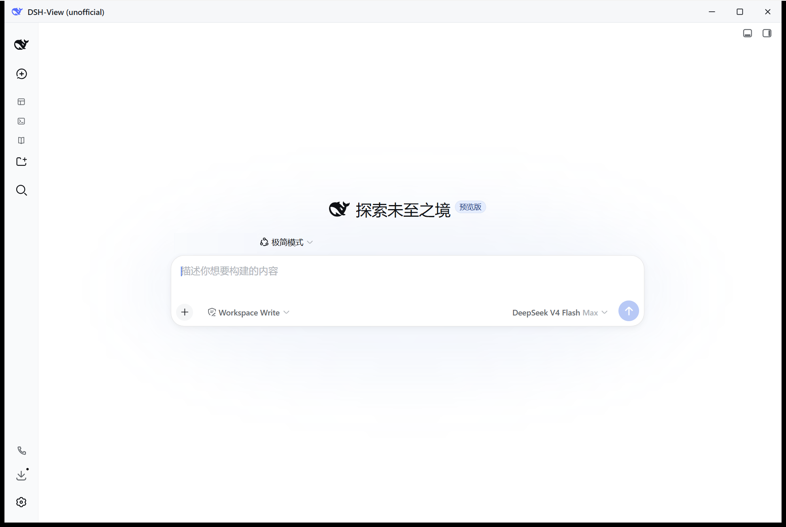

# DSH-View

非官方的 DeepSeek Harness 桌面窗口——把本机 DSH(`npx @deepseek-ai/dsh web`)的网页界面装进一个真正的原生窗口(任务栏图标、自绘标题栏、无边框拖拽)。

> ⚠️ **免责声明 / Disclaimer**
>
> 本项目为社区第三方工具,非 DeepSeek 官方产品。本项目与 DeepSeek(深度求索)没有任何关联,亦未获得其赞助或背书。
>
> This project is an unofficial, community-maintained third-party tool. It is not affiliated with, sponsored by, or endorsed by DeepSeek in any way.
>
> "DeepSeek" 及鲸鱼标志是 DeepSeek(深度求索)持有的商标,本仓库仅在标题栏等位置使用 DSH 自带的官方 favicon 资源以标识被启动的服务,版权与商标权均归 DeepSeek 所有。

---

## ✨ 功能亮点

- **自动拉起并嵌入 DSH Web UI**:启动时自动挑选空闲端口(3080–3089)拉起本机 DSH 服务,WebView2 直接加载 `http://127.0.0.1:<port>`,无需手动开浏览器。
- **Job Object 进程树清理**:DSH 进程被纳入 Windows Job Object,即便壳进程被任务管理器强杀,DSH 进程树也会被系统一并终止,杜绝后台残留。
- **端口属主兜底**:首次启动优先直跑全局 `bin.js`(单层进程树,Job Object 完全覆盖);若未全局安装则回退 `npx -y @deepseek-ai/dsh`,并辅以端口属主 `taskkill` 兜底,确保不留僵尸进程。
- **自绘标题栏**:无边框窗口 + 鲸鱼 LOGO + 最小化/最大化/关闭三键 + 鼠标拖拽,体验贴近原生应用。
- **系统深浅色跟随**:标题栏 CSS `prefers-color-scheme` 自动跟随系统主题,DSH 内部默认也是 system 模式,无需手动切换。
- **WebView 禁用系统代理**:`--no-proxy-server` 启动 WebView2,避免本机 `127.0.0.1:3080` 被公司/系统代理劫持。
- **纯本地运行**:所有通信发生在 `127.0.0.1`,壳本身不上传任何数据到任何远端服务器。

## 📷 截图



## 📋 前置条件

- **操作系统**:Windows 10 / Windows 11(WebView2 Runtime 一般系统自带)
- **Node.js**:≥ 18(只需 `npx` 可用即可,不必全局安装 DSH)
- **DeepSeek Harness**:首次运行壳会通过 `npx` 自动拉取 `@deepseek-ai/dsh`,无需手动安装

## 🚀 快速开始

1. 前往 [Releases](../../releases) 页面,下载最新版的 `DSH-View.exe`。
2. 双击运行即可。
3. 首次运行 SmartScreen 可能弹出"未知发布者"提示——这是因为 exe 未做代码签名。请点击 **"更多信息" → "仍要运行"** 继续。
4. 窗口显示「正在启动 DeepSeek Harness…」,首次需下载依赖,可能要一两分钟;之后每次启动都会很快。
5. 就绪后自动进入 DSH 界面,正常使用即可。
6. 点击右上角 ✕ 关闭窗口,DSH 服务随之退出,不留后台进程。

## 🛠️ 从源码构建

环境要求:

- Rust stable toolchain(参考 [rustup.rs](https://rustup.rs))
- Visual Studio Build Tools,带 **C++ 工作负载**(MSVC)
- Node.js ≥ 18

构建步骤:

```bat
git clone https://github.com/yangkai9703/DSH-View.git
cd DSH-View
npm install
scripts\build_env.bat npm run build
```

> `scripts\build_env.bat` 会自动探测本地 MSVC `vcvars64.bat` 并初始化 x64 构建环境,然后在 `src-tauri/` 子目录执行你传入的命令(如 `cargo check`、`npm run build` 等)。
>
> 构建产物:`src-tauri/target/release/dsh-shell.exe`;NSIS 安装包在 `src-tauri/target/release/bundle/nsis/`。

开发模式:

```bat
npm install
scripts\build_env.bat npm run dev
```

## ❓ FAQ

**① 启动时卡在"正在启动"超过几分钟,或者报 "task-board ledger is already owned by process"?**

这是 DSH 上次异常崩溃后留下的锁文件导致。删除用户目录下的 `~/.dsh/task-board/ledger-v2.lock` 即可(属主进程已死时安全),然后重新启动壳即可。

**② 首次启动为什么这么慢?**

首次启动需要 `npx` 下载 `@deepseek-ai/dsh` 包及其依赖(可能几十 MB),耗时一两分钟属正常现象。后续启动会复用本地缓存,很快。

**③ 端口被占用怎么办?**

壳默认从 `3080` 开始,若被占用自动向后试探到 `3089`。如果该端口上已经在运行 DSH 实例,壳会直接复用,不会重复拉起。

**④ 数据安全吗?壳会上传我的对话内容吗?**

完全本地。壳通过 WebView2 加载 `http://127.0.0.1:<port>`,所有 HTTP 通信发生在本机回环;壳本身不连接任何远端服务器,也不读取、改写或转发 DSH 的任何数据。WebView2 已通过 `--no-proxy-server` 关闭系统代理,杜绝被中间人劫持的可能。

## 📄 License

本项目以 [MIT](./LICENSE) 协议开源。

## 🏛️ 商标

DeepSeek® 及鲸鱼标志是 DeepSeek(深度求索)的商标,详见 [TRADEMARKS.md](./TRADEMARKS.md)。
